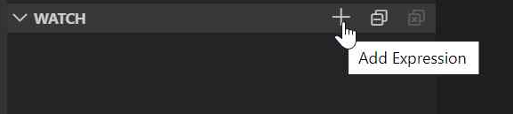
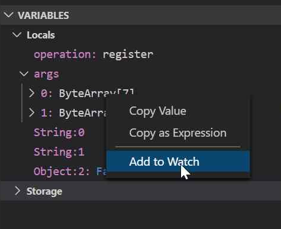
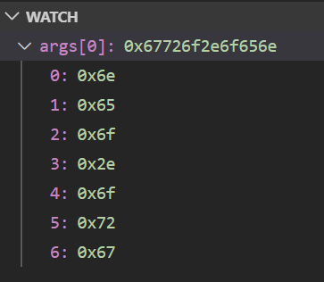
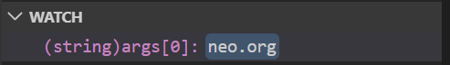
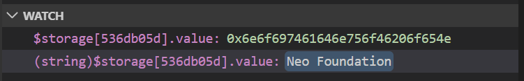

Certainly! Here’s an expanded and detailed version of the EpicChain Smart Contract Debugger Variable Evaluation Reference, elaborating on every aspect and including additional context to make it as comprehensive as possible:

---

# EpicChain Smart Contract Debugger Variable Evaluation Reference

The EpicChain Smart Contract Debugger is an advanced tool designed to facilitate the development and debugging of smart contracts on the EpicChain blockchain platform. It leverages detailed information from the [EpicChain Virtual Machine](https://github.com/epic-chain/epic-vm) and the [debug info file](https://github.com/epic-chain/epic-design-notes/blob/master/NDX-DN11%20-%20EpicChain%20Debug%20Info%20Specification.md) produced by the smart contract compiler. This documentation provides a thorough guide on how to effectively use the Debugger's variable evaluation features within the [Visual Studio Code Data Inspection Window](https://code.visualstudio.com/docs/editor/debugging#_data-inspection).

Understanding and manipulating how variables are displayed in the IDE can significantly enhance debugging efficiency. Developers often need precise control over the presentation of variable data, which can be achieved through the Watch window and various cast operations. This guide aims to provide a comprehensive overview of how to utilize these features to their full potential.

> **Note:** The screenshots and examples provided in this document use the [C# Domain smart contract sample](https://github.com/epic-chain/domain-sample) for demonstration purposes. This sample is utilized to illustrate concepts and operations in a practical context.

## Adding Variables to the Watch Window

The Watch window is an essential feature of the EpicChain Smart Contract Debugger, allowing developers to monitor and inspect variables during the debugging process. There are two primary methods to add a variable to the Watch window:

### Method 1: Using the `Add Expression` Command

1. **Access the Watch Window Toolbar:**
   - Locate the Watch window within your Visual Studio Code environment. This window is usually accessible via the Debug panel.
   - Click on the `Add Expression` button located on the toolbar of the Watch window.

2. **Add the Variable:**
   - Enter the variable or expression you wish to monitor. This could be a variable name or a more complex expression involving variables and functions.

   

   By using this method, you can manually input any variable or expression you need to monitor, providing flexibility in how you track the state and behavior of your smart contracts.

### Method 2: Using the `Add to Watch` Command

1. **Access the Variable Context Menu:**
   - During a debugging session, locate the Variables window, which displays all currently in-scope variables.

2. **Add the Variable:**
   - Right-click on the variable you want to add to the Watch window.
   - Select the `Add to Watch` command from the context menu.

   

   This method allows you to quickly add variables to the Watch window without manually typing their names, making it more efficient when dealing with multiple variables.

## Customizing Variable Display with Cast Operators

Once a variable is added to the Watch window, its default display might not always be optimal for analysis. Developers can customize the presentation of these variables using cast operators. By applying a cast operator, you can control how the variable is formatted and displayed, making it easier to interpret complex data.

### Default Display without Cast Operator

By default, variables are displayed in their raw format, which might not always be immediately understandable. For instance, the `args[0]` variable might be shown as a byte array, which is less readable for developers who need to understand the actual data content.



### Applying Cast Operators

To enhance readability and usefulness, you can apply cast operators. For example, if `args[0]` is actually a string but is displayed as a byte array by default, you can apply the `(string)` cast operator to convert it to a more human-readable format.



### Supported Cast Operators

The EpicChain Smart Contract Debugger supports several cast operators, each corresponding to different data types. This functionality is crucial for accurately interpreting the values stored in variables. The supported cast operators include:

| **Cast Operation** | **Data Type** |
| ------------------ | ------------- |
| `(int)`            | Integer       |
| `(bool)`           | Boolean       |
| `(string)`         | String        |
| `(hex)`            | Hex Encoded String |
| `(byte[])`         | Byte Array    |

These operators allow you to view and manipulate the variables in various formats, which is essential for debugging and validating the behavior of your smart contracts.

## Handling Storage Variables

Storage variables are a special category of variables that are used to persist data across transactions in smart contracts. These variables can also be added to the Watch window and manipulated using cast operators. Storage variables are accessed using a special syntax involving the `$storage` marker.

### Specifying Storage Variables

Storage slots are identified using the `$storage` marker followed by an index operator. The index value is derived from the storage slot key, and while it differs from the key itself, it maintains a stable relationship with the key.

For example, to inspect a storage variable, you might use the following syntax:

```json
$storage[536db05d].value
```

This notation allows you to view the value stored at a specific storage slot. In the Watch window, you can view the `$storage[536db05d].value` both as a byte array and as a string, depending on the cast operator applied.



### Important Note on Key Values

The `$storage` variable uses a custom-calculated key value for display purposes. This is because actual storage key values can be of arbitrary length. To ensure a consistent and compact display, the custom key is always eight characters long, regardless of the actual key length. This approach minimizes screen space usage while maintaining readability.

> **Note:** While the custom key value simplifies visual representation, it does not affect the underlying data or its retrieval. The custom key is designed solely for display purposes in the Watch window.

## Conclusion

This comprehensive guide provides an in-depth overview of variable evaluation and display in the EpicChain Smart Contract Debugger. By utilizing the Watch window and applying various cast operators, developers can gain precise control over how variables are presented and interpreted during debugging sessions. This capability is essential for effective smart contract development and troubleshooting.

For additional information, support, or to contribute to the development of the EpicChain Debugger, please visit our [GitHub repository](https://github.com/epicchainlabs/epicchain-debug-wizard) or consult the extensive EpicChain documentation available online.
