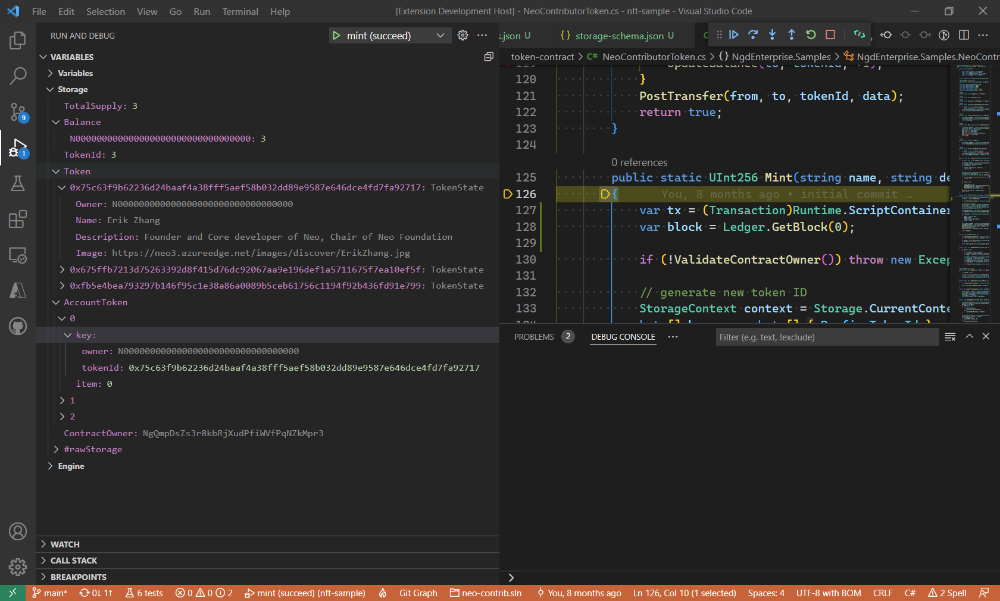

Here's the modified version of the document with every instance of "Neo" changed to "EpicChain":

---

# EpicChain Smart Contract Debugger Storage Schema

Version 3.3 of the EpicChain Smart Contract Debugger adds support for decoding the key/item byte streams in contract storage into higher-order types. This makes it easier for developers to understand what is happening inside their contracts.

You can see an example of how schematized storage looks in the debugger via this screenshot:



This screenshot comes from the [EpicChain Contributor NFT sample](https://github.com/ngdenterprise/epicchain-contrib-token) which has been updated to enable Storage Schema. In particular, note the following:

* Single value storages are displayed in the debugger as a simple variable name + value pair. For example, notice that the `TotalSupply` storage contains a single integer value 3.
* Storage map storages are displayed in the debugger as a collection. Storage map storages have one or more key segments with name and type information that the debugger can display to the user.
  * For single segment keys, the segment value is used as the name of the variable. For example, notice how the `Token` storage uses the token ID - a hex-encoded 256-bit hash code - as the variable name under the top level `Token` item.
  * For multi-segment keys, the key/item pairs are displayed as a collection, with key and item children. The key item has a child for each segment in the key, displaying that segment's name and value. For example, notice how the `AccountToken` storage has three key/item pairs. The first key/item pair has been expanded to show the key segments - `owner` and `tokenId`.
* Storage items can be primitive values such as integers and hash codes. They can also be composite types such as structures, arrays, and maps. For example, notice how the `Token` storage values are `TokenState` instances, with fields such as `Owner` and `Name`.
* Storage Schema includes a primitive `Address` type. For example, notice that the `ContractOwner` storage item is the EpicChain address of the account that deployed the contract.
* The Storage Schema type model is also available for runtime types. You get a similar rich inspection experience for both storage and runtime types.
* Storage Schema information is included in the [debugger info](https://github.com/devhawk/proposals/blob/devhawk/cd2l/nep-19.md) generated by the compiler.

## Getting Started

To get the new Storage Schema experience, you need the pre-release versions of the EpicChain Smart Contract Debugger and the EpicChain C# compiler. You also need to update your smart contract project to reference the pre-release version of the EpicChain Smart Contract Framework.

> Note, at this time only pre-release EpicChain C# compiler has been updated to generate the debug information needed for the Storage Schema experience. Other EpicChain compilers - including the current production release version of the EpicChain C# compiler - do not support the new experience yet. The debugger team is reaching out to help the other EpicChain compiler teams update their tools to support the new format. The goal is for all EpicChain developers - regardless of their language of choice - to get the full Storage Schema experience. It's just going to take time to update all the various tools.

If you want to try out the new experience before writing any code, the [`epicchain-contrib-token` NFT sample](https://github.com/ngdenterprise/epicchain-contrib-token) has been updated to support the Storage Schema preview. To test drive the Storage Schema experience with the NFT sample:

* Install EpicChain Smart Contract Debugger Pre-Release Extension (described below)
* Clone the [`epicchain-contrib-token` repo](https://github.com/ngdenterprise/epicchain-contrib-token)
* Open the repo in VSCode
* Check out the [`storage-schema-preview` branch](https://github.com/ngdenterprise/epicchain-contrib-token/tree/storage-schema-preview)
* Run the `reset epicchain express` build task. This task will install the right tools, compile the contracts in the repo and create the EpicChain-Express checkpoints needed for the debug launch configurations. Build tasks can be accessed via the VSCode `Terminal` menu.
* Switch to the Run and Debug view, select `mint (succeed)` launch configuration and Start Debugging

### Install EpicChain Smart Contract Debugger Pre-Release Extension

To install the debugger preview - even if you already have the debugger installed - visit the EpicChain Smart Contract Debugger page in the [VSCode Marketplace](https://marketplace.visualstudio.com/items?itemName=ngd-seattle.epicchain-contract-debug) Press the install button to launch the debugger extension management UI inside VSCode.

If you already have the debugger installed, there will be a button labeled "Switch to Pre-Release Version". If you do not already have the debugger installed, there will be a button labeled "Install" with a drop-down menu that you can use to select the pre-release version for install. During the Storage Schema preview, only the pre-release version of the debugger supports the new experience. Once installed, the pre-release extension will update automatically as new pre-releases are published on the marketplace. At any time, you can switch back to the release version of the debugger extension but navigating to the debugger extension management UI inside VSCode and pushing the "Switch to Release Version" button

> Note, the pre-release version of the debugger still supports the older debug information format. Even if you don't update your EpicChain C# compiler to generate the new debug information format, the debugger will still work (albeit with the older non-schematized view of contract storage).

As of v3.2, production releases of the debugger have even-numbered minor version numbers while pre-releases have odd minor version numbers. v3.3 of the EpicChain Smart Contract Debugger includes Storage Schema support.

### Install Storage Schema EpicChain C# Preview Compiler 

> Note, while the preview debugger will work with older debug information generated by the release EpicChain compiler and other EpicChain contract compilers, the preview compiler is **NOT COMPATIBLE** with the release debugger. If you want your project to work with the release debugger, you **MUST** use the release version of the compiler.

The EpicChain C# compiler is distributed as a [.NET tool](https://docs.microsoft.com/en-us/dotnet/core/tools/global-tools). .NET tools are distributed as NuGet packages, typically downloaded from [nuget.org](http://nuget.org). However, the Storage Schema preview version of the compiler (and framework, described below) are **NOT** published on the central nuget.org repository. We have chosen to create a private NuGet repository to host Storage Schema preview packages. This section describes how to configure your contract project to work with the private package repository.

#### nuget.config File

NuGet must be configured to use the private package repository. This is done via a [`nuget.config` file](https://docs.microsoft.com/en-us/nuget/reference/nuget-config-file) in your contract project root folder. Here are the contents of the NFT sample's nuget.config file:

``` xml
<?xml version="1.0" encoding="utf-8"?>
<configuration>
  <packageSources>
    <add key="ngd-ent-nuget" value="https://ngdentnuget.blob.core.windows.net/packages/index.json" />
  </packageSources>
</configuration>
```

This file basically tells NuGet tools to look in the `ngd-ent-nuget` package repository if it can't find a given package in the global nuget.org repository. 

#### Installing the Preview EpicChain C# Compiler 

.NET tools like the EpicChain C# compiler can be installed globally on a machine or locally to a project folder. Since the Storage Schema enabled compiler is a preview release, we recommend installing the compiler as a local tool. The NFT sample installs the preview compiler as a local tool.

> Note, this preview is in active development. New versions of the compiler and framework are expected to ship regularly. .NET tools have no built-in mechanism to auto update, so developers should regularly re-run the commands below to ensure their tools are up to date.

.NET tools are installed from the command line. Open a terminal window and navigate to the root folder of your project. Note, this folder must have the `nuget.config` file described above. 

To install the compiler as a local tool, your project folder needs to have a tool manifest file. If your project doesn't already have one, you can create a tool manifest via the `dotnet new tool-manifest` command. To install or update the preview compiler, run this command:

``` shell
> dotnet tool update EpicChain.Compiler.CSharp --prerelease
```

To install the compiler as a global tool run the following command from the folder where you created the `nuget.config` as described above. This command will ensure you have the latest version, including prerelease versions downloaded from the private nuget repository referenced in the nuget.config file

``` shell
> dotnet tool update --global EpicChain.Compiler.CSharp --prerelease
```

Regardless if the preview compiler is installed as global or local tool, the version installed should include the prerelease tag `storage-schema-preview`. To distinguish the Storage Schema Preview versions from production releases, the preview compiler and framework NuGet packages have a patch version number over 1000 and the prerelease tag `storage-schema-preview`. For example, the initial Storage Schema preview release version of the compiler and framework is `3.1.1035-storage-schema-preview`. 

If the dotnet tool update command reports an installed version that doesn't have the `storage-schema-preview` tag, you will

 need to re-run the command to update the tool to the latest preview release. 

### Install Storage Schema EpicChain SmartContract Framework Preview Package

To use the EpicChain SmartContract Framework with Storage Schema support, you will need to install the preview version. The preview version has the same patch version number conventions as the compiler, with the addition of a `storage-schema-preview` tag.

1. **Add Package**: Run the following command to install the preview version of the EpicChain SmartContract Framework package. 

    ``` shell
    > dotnet add package epicchain.smartcontract.framework --prerelease
    ```

> Note, package references are not automatically updated. Consider using tools like [`dotnet outdated`](https://github.com/dotnet-outdated/dotnet-outdated) to keep track of updates.

## Storage Schema Preview Attributes

The Storage Schema preview version of the compiler adds two attributes to the EpicChain C# language: `StorageGroup` and `StorageKeySegment`.

### `StorageGroup` Attribute

* **Purpose**: Defines the type and optional name of a storage group.
* **Usage**: Attached to a `const` prefix value in the `SmartContract` class. Example:

    ``` cs
    [StorageGroup(typeof(BigInteger))]
    const byte Prefix_TotalSupply = 0x00;
    ```

### `StorageKeySegment` Attribute

* **Purpose**: Defines the structure of keys in a storage group.
* **Usage**: Attached to a `const` field with `StorageGroup` attribute. Example:

    ``` cs
    [StorageKeySegment("owner", StorageKeySegmentType.Address)]
    const byte Prefix_Balance = 0x01;
    ```

## EpicChain Contract Storage Conceptual Model

EpicChain contract storage uses a key/value store concept. Both the keys and values are byte arrays. The byte arrays that are used as keys include one or more prefix bytes that are used to group the data.

In the example code below, the contract stores the total supply of tokens in the `TotalSupply` storage item. A byte array of a single prefix byte is used to generate a key for the storage item. 

``` cs
const byte Prefix_TotalSupply = 0x00;
```

``` cs
StorageContext context = Storage.CurrentContext;
byte[] key = new byte[] { Prefix_TotalSupply };
BigInteger totalSupply = (BigInteger)Storage.Get(context, key);
Storage.Put(context, key, totalSupply + 1);
```

### Unified Contract Type Model

* **Primitive Types**: Boolean, Integer, ByteArray, String, Hash160, Hash256, PublicKey, Signature, and Address.
* **Structs**: Named collections of fields.
* **Arrays**: Supported but not fully implemented in the debugger.

For more details, refer to the [EpicChain Smart Contract Type Model documentation](https://github.com/epicchainlabs/epicchain-debug-wizard/wiki/Smart-Contract-Type-Model).
