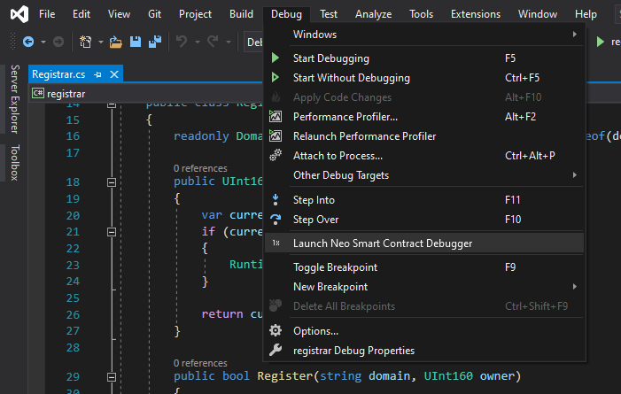

Certainly! Here is a revised version of the message that is more detailed and extensive:

---

# EpicChain Smart Contract Debugger for Visual Studio

> Please be aware that the EpicChain Smart Contract Debugger for Visual Studio is currently in its preview stage. We encourage users to report any issues or bugs encountered on our [GitHub repository](https://github.com/epicchain-project/epicchain-debugger/issues).

To utilize the EpicChain Smart Contract Debugger within Visual Studio, ensure that you have a project open that is compatible with Visual Studio, such as a C# project. It is important to note that the current preview versions of the EpicChain Smart Contract Debugger do not support the "Open Folder" mode available in Visual Studio.

Within your Visual Studio project, the EpicChain Smart Contract Debugger will search for files named `launch*.json`. These JSON configuration files must include either a single launch configuration ([see example](https://github.com/epicchainlabs/epicchain-debug-wizard)) or a set of launch configurations compatible with [VSCode](https://go.microsoft.com/fwlink/?linkid=830387). The launch configurations supported by the EpicChain Smart Contract Debugger adhere to the same properties as those used by the EpicChain Smart Contract Debugger for VSCode. 

To indicate that a launch configuration file is compatible with the EpicChain Smart Contract Debugger, it must specify its type as `epicchain-contract` ([view example](https://github.com/epicchainlabs/epicchain-debug-wizard/blob/master/.vscode/launch.json#L41)).

To initiate the debugging process, you should select "Launch EpicChain Smart Contract Debugger" from the Debug menu located at the top level of Visual Studio.

